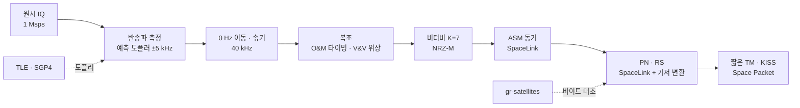
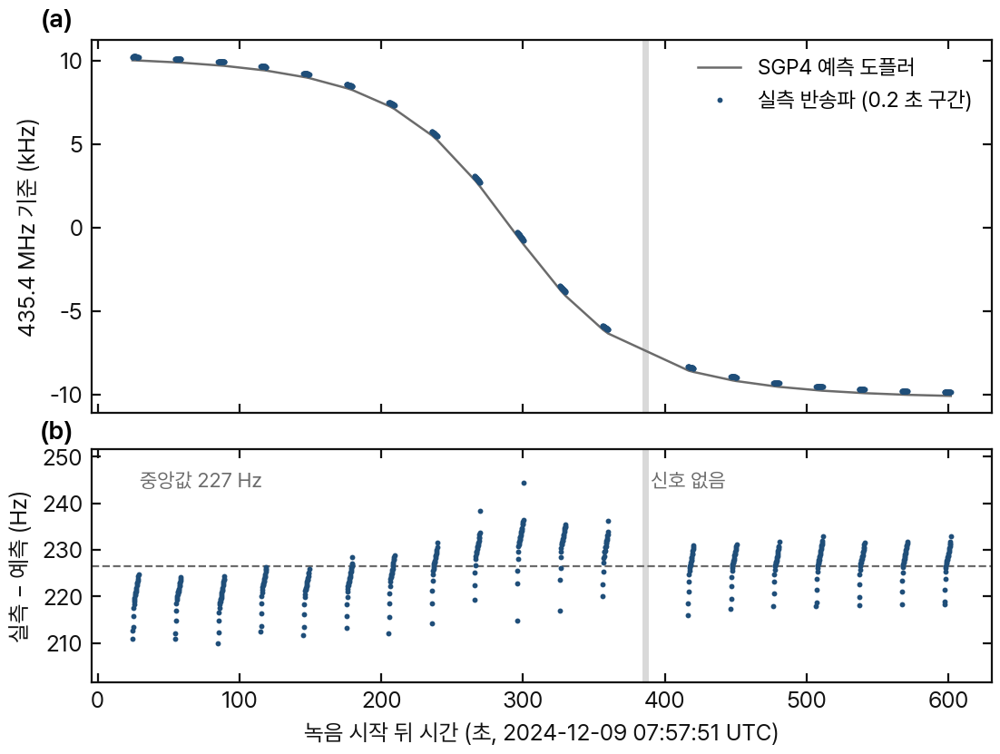
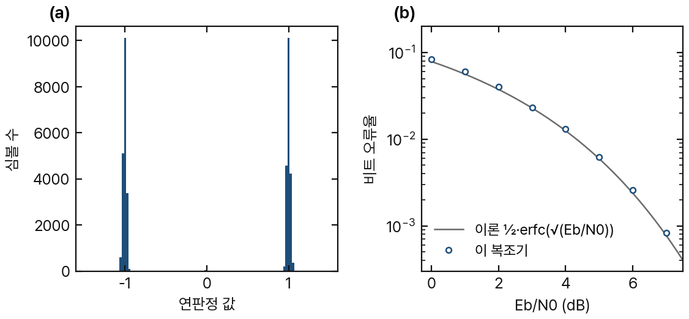
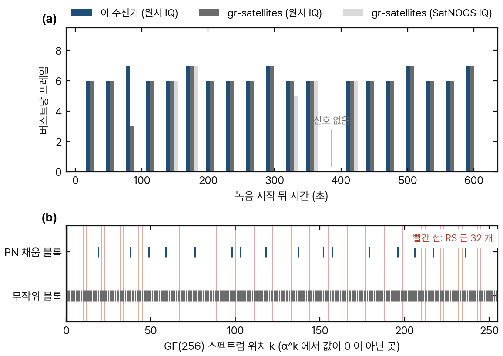

# Ground Station Receiver: From Raw IQ Recording to CCSDS Space Packets with Orbit-Based Doppler Correction

위성 지상국 수신 처리기 (C# / .NET 10) 및 신뢰성 시험 — 원시 IQ 녹음 → 궤도 기반 도플러 → 복조 → 비터비 → CCSDS 프레임 → Space Packet

Haejyn · 기술 보고서 · 2026


## 1. 범위

본 저장소는 실제 위성 패스의 원시 IQ 녹음에서 텔레메트리 프레임을 복원하는 지상국 수신 처리기이다. TLE · SGP4 로 도플러를 예측하여 반송파 탐색 창을 정하고, 블록 전방 추정 방식의 BPSK 복조, 비터비 복호를 거친 뒤, 채널 복호 뒷단(ASM · PN · RS · TM 프레임 · 패킷)은 [SpaceLink](https://github.com/Haejyn/ccsds-downlink-reliability) v1.1 을 코드 수정 없이 서브모듈로 재사용한다.

설계상의 핵심 요구는 다음과 같다.

> **정답은 구현 밖에서 가져온다.** 궤도는 Vallado 의 SGP4 공식 검증 출력과 독립 구현(Skyfield), 신호는 실제 위성 녹음과 다른 지상국의 복호 결과로 판정한다.

**대상 및 입력**

| 항목 | 내용 |
|---|---|
| 위성 | ASRTU-1 (저궤도 큐브샛, 435.4 MHz BPSK 9k6, CCSDS 연접 부호) |
| 입력 | 네덜란드 드빙겔로 25 m 전파망원경 원시 IQ 녹음, 한 패스 11 분 (CAMRAS, CC BY 4.0) |

**주요 결과**

| 항목 | 결과 |
|---|---|
| 도플러 예측 | SGP4 예측 vs 실측 반송파, 20 kHz 스윕에서 잔차 RMS 5.1 Hz |
| 프레임 복원 | 119 프레임, 녹음에 신호가 있는 프레임 전부 (프레임 카운트로 확인) |
| 외부 대조 | gr-satellites 독립 복호 3 가지의 합집합 115 장과 바이트 단위 일치 |
| 결함 발견 | RS 를 통과하는 PN 채움 신호 → 관성 블록 정책으로 차단 |
| 시험 품질 | 시험 84 · 라인 커버리지 98.6 % · 뮤테이션 95.53 % · 요구사항 추적 16/16 |

## 2. 적용 문서

| 문서 | 제목 | 적용 범위 |
|---|---|---|
| CCSDS 131.0-B-5 | TM Synchronization and Channel Coding | 컨볼루션 부호 (K=7) · ASM · PN · Reed-Solomon |
| Vallado et al., SGP4-VER | SGP4 공식 검증 출력 (tcppver.out) | SGP4 구현 검증 기준 |

| 내부 문서 | |
|---|---|
| [요구사항 명세](docs/requirements.md) | REQ-ID 별 요구사항과 판정 기준 |
| [추적 매트릭스](docs/traceability.md) | 요구사항 ↔ 시험 ↔ 결과 |
| [기준 자료 출처](tests/GroundStationRx.Tests/golden/README.md) | 시험 기준 자료의 생성 방법과 출처 |

## 3. 시스템 개요



## 4. 궤도 예측과 실제 신호


<sub>그림 1. ASRTU-1 드빙겔로 패스 (2024-12-09 07:57–08:08 UTC). (a) SGP4 예측 도플러와 실측 반송파 (b) 실측 − 예측, 점선은 중앙값. 회색 띠는 녹음에 신호가 없는 버스트</sub>

- 반송파 측정: 신호 제곱 → 2f 선 (변조 무관). 예측 도플러 ±5 kHz 창 안에서만 탐색한다. 녹음에 −90 kHz 다른 송신원이 있어 창이 필요하다.
- 송신기 고정 오차 약 +224 Hz.
- 버스트마다 켜질 때 약 12 Hz 흐름 (발진기 가열). 모든 버스트에서 같은 형태.
- 시각 어긋남 적합: −53 ± 7 ms (진행 방향 약 0.4 km). 최근접 부근의 5 Hz 언덕이 이 성분이다.
- SGP4 는 Vallado 공식 검증 출력과 위치 차이 7 μm, 지상국 기하는 Skyfield 대비 거리 변화율 58 mm/s.

## 5. 복조


<sub>그림 2. (a) 실제 버스트 한 개 (38,862 심볼)의 연판정 값 분포 (b) 합성 신호 BER 과 이론 곡선. 심볼율 9600.7 baud · 타이밍 0.37 심볼 · 반송파 0.8 Hz 오차 포함</sub>

- 녹음 후처리이므로 되먹임 루프 대신 블록 전방 추정을 사용한다.
  - 타이밍: Oerder–Meyr (|y|² 의 심볼율 선 위상). 창 단위로 펼쳐 이어 심볼 미끄러짐이 없다.
  - 위상: Viterbi–Viterbi (BPSK 제곱). mod π 로 펼치고, 남는 180° 모호성은 NRZ-M 이 흡수한다.
- 심볼율 실측 9600.82 → 9600.37 baud. 심볼 클럭에도 도플러가 나타난다 (예측 ±0.22 baud, 폭 0.44 · 실측 폭 0.45). 가운데 값 +0.6 baud 는 위성 클럭 오차이다.
- 구현 손실 0.05~0.2 dB (Eb/N0 0~7 dB).

## 6. 복호 결과와 PN 채움


<sub>그림 3. (a) 버스트별 복원 프레임 — 본 수신기 · gr-satellites (원시 IQ, 도플러 보정 없이 FLL) · gr-satellites (SatNOGS IQ 덤프, 포화) (b) GF(256) 스펙트럼에서 값이 0 이 아닌 위치</sub>

### 6.1 복원

- 버스트 19 개 · 프레임 119 장 · RS 실패 1 블록.
- 마스터 채널 카운트 0x15 → 0x92 중 빈 곳 한 군데 (7 장) = 녹음에 반송파가 없는 버스트.
- 본 수신기만 받은 4 장: 녹음 첫 버스트 (고도 10.5°). gr-satellites FLL 이 반송파를 찾던 구간이다.

### 6.2 PN 채움 신호

- 버스트 끝에서 마커 없는 블록 하나가 RS 를 오류 0 으로 통과하였다.
- 정체: PN 수열을 거꾸로 읽은 채움 (223 바이트 전부 일치, 두 버스트 동일).
- 원인: PN 은 GF(256) 스펙트럼이 8 점뿐이라 RS 근 32 개를 모두 피하므로 구조적으로 부호어가 된다 (순환 이동 255 가지 전부 확인).
- 대응: 관성(flywheel) 블록은 뒤 마커가 경계를 확인할 때만 채택한다.

## 7. 검증

| 대상 | 기준 | 결과 |
|---|---|---|
| SGP4 | Vallado SGP4-VER · tcppver.out | 근지구 9 기 · 158 시점, 위치 차이 7 μm |
| 거리 · 거리 변화율 | Skyfield (세차 · 장동 · UT1 포함) | 10 m · 58 mm/s (도플러 0.08 Hz) |
| 도플러 | 실제 녹음 반송파 | 스윕 19.8 kHz, 잔차 RMS 5.1 Hz |
| 복조 | BPSK 이론 BER | 이론 대비 0.05~0.2 dB |
| 비터비 | 부호 이득 | Eb/N0 4.5 dB 에서 40 만 비트 오류 0 |
| RS (관례 기저) | reedsolo 부호어 680 개 | 오류 0~16 개 전부 복원 · 17 개 200/200 실패 선언 |
| 프레임 | gr-satellites 5.7 (3 가지 입력) | 합집합 115 장 바이트 일치 |
| 누락 | 위성 프레임 카운트 | 신호 없는 버스트 외 0 |

| 시험 품질 지표 | 값 |
|---|---|
| 시험 | 84 통과 · 빌드 경고 0 (녹음 시험 8 개는 녹음이 있을 때만 실행, 없으면 건너뛰고 추적표에서 미검증 처리) |
| 커버리지 | 라인 98.6 % · 분기 96.7 % (녹음 시험 포함) |
| 뮤테이션 | 95.53 % (Stryker.NET, 단위 시험만) · 1 차 71.35 % → 판정 · 보강 → 2 차 · 생존 41 개 판정 (문자열 13 · 동등 4 · 이후 시험 추가 · SGP4 미도달 분기 기록) |
| 요구사항 추적 | 16/16 |

| 처리 결과 | 값 |
|---|---|
| 녹음 처리 시간 | 짧은 녹음 68 초 → 약 3 초 · 패스 560 초 → 약 20 초 |
| 복원 | 버스트 19 · 프레임 119 · Space Packet (짧은 녹음) 12 개, 순서 카운트 빈틈 없음 |
| 도플러 적합 | 370 구간 · 고정 오차 224.5 Hz · Δt −53 ± 7 ms · 잔차 RMS 5.12 → 4.73 Hz |

## 8. 결함 보고

| 내용 | 발견 경로 | 조치 |
|---|---|---|
| PN 채움이 RS 통과 | 버스트 끝 블록 분석, GF(256) 스펙트럼 | 관성 블록은 뒤 마커 확인 시만 채택 |
| 위성의 비표준 TM 헤더 (5 바이트) | SpaceLink 가 `InvalidDataFieldStatus` 로 거부 | 짧은 TM 전송 계층 추가 |
| 송신기 +224 Hz · 켜질 때 12 Hz 흐름 | 반송파 잔차 | 예측 도플러 ±5 kHz 창 |
| 녹음의 다른 송신원 (−90 kHz) | 전 대역 탐색에서 엉뚱한 선 검출 | 창 안 탐색 |
| 녹음에 신호 없는 버스트 1 개 | 프레임 카운트 빈 곳 · 반송파 선 11 dB | 수신기 결함 아님으로 판정 |
| 약한 버스트를 통째로 놓침 (Es/N0 6 dB 이하) | 합성 송신기 끝에서 끝까지 시험 | 검출 문턱 30 → 18 dB (잡음 실측 11~12.6 dB) |
| 버스트가 구간을 거의 채우면 예외 | 합성 시험 | 잡음 바닥 추정 수정 |
| 센 먼 방해 신호가 측정 창으로 누설 | 뮤테이션 판정 (영점에 놓인 시험 신호) | 이동 평균 3 단 (CIC) |
| 신호 없는 구간 → 무한 반복 · 메모리 부족 | 뮤테이션 판정 중 추가한 시험 | 입력 거부 · 버스트 단위 실패 기록 |
| 잃은 프레임 뒤 조각이 정상 패킷 형태 | 뮤테이션 판정 (길이 검사로는 구분 불가) | 가상 채널 카운트 빈틈 → 조각 폐기 (시험 고정) |

### 8.1 기각된 가설 · 측정

| 초기 가설 | 실제 |
|---|---|
| 최근접 부근 잔차 18 Hz = 시각 오차 0.17 초 | 버스트 요약값의 시각 어긋남이 만든 값. 구간 단위 적합에서 Δt −53 ms |
| gr-satellites 는 도플러 보정 없이 패스를 따라가지 못한다 | FLL 로 ±10 kHz 추적, 차이는 4 장 |
| SatNOGS IQ 덤프 = float32 · 38.4 ksps | int16 · 76.8 ksps, 표본 75~89 % 포화 |
| reedsolo `generator=11` = α¹¹ | 원소 값 11. CCSDS 는 α¹¹ = 0xAD |
| 창별 타이밍 선택으로 충분하다 | 4 초 버스트에서 심볼 3 번 미끄러짐 → 전방 추정 + 펼침 |

## 9. 한계

- 위성 1 기 · 패스 1 회 (UHF 9k6 BPSK).
- 녹음 후처리 전용 (블록 전방 추정). 실시간 스트리밍이 아니다.
- SGP4 근지구만 지원 (심우주 거부).
- 텔레메트리 필드 해석 없음 (Space Packet 까지).
- 녹음 시각 출처가 장비 내부 시계 (`vrt:time_source internal`).
- 가까운 인접 채널 신호는 반송파 측정 창으로 막지 못한다 (2f ± 심볼율 곁선).
- 뮤테이션 시험 1 회에 약 4 시간 40 분 소요 (시간 초과 변이 451 개). 마지막 보강 이후 재측정하지 않았다.

## 10. 빌드 및 시험

```bash
git clone --recursive https://github.com/Haejyn/ground-station-rx
python tools/fetch_recordings.py                         # 녹음 2.7 GB (sha256 확인), 없으면 녹음 시험은 건너뜀
GSRX_RECORDINGS=recordings dotnet test tests/GroundStationRx.Tests -c Release
python tools/trace.py                                     # 요구사항 추적
python tools/gen_golden_link.py --check                   # Skyfield 기준 재현
python tools/gen_golden_rs_conventional.py --check        # reedsolo 기준 재현
python tools/gen_golden_grsatellites.py --check           # gr-satellites 기준 재현 (radioconda)
dotnet run -c Release --project tools/PassReport && python tools/make_readme_figures.py   # README 그림
```

## 11. 저장소 구성

| 경로 | 내용 |
|---|---|
| `src/GroundStationRx/Orbit/` | TLE · SGP4 · 지구 좌표 · 거리 변화율 · 도플러 잔차 적합 |
| `src/GroundStationRx/Dsp/` | FFT · FIR · 반송파 측정 · 버스트 복조기 |
| `src/GroundStationRx/Coding/` | 비터비 · NRZ-M · 관례 기저 RS (SpaceLink 감쌈) |
| `src/GroundStationRx/Receiver/` | 수신 체인 · 관성 블록 정책 · 짧은 TM · KISS |
| `src/GroundStationRx/Recording/` | SigMF (ci16 · cf32 · cu8) |
| `src/GroundStationRx/Simulation/` | 합성 BPSK · 합성 송신기 (수신 체인의 거울, 녹음 없이 끝에서 끝까지 시험) |
| `external/` | SpaceLink v1.1 · orbit-pass-sim v1.0 (서브모듈) |
| `tests/` | xUnit 84 개 · 기준 자료 `golden/` |
| `tools/` | 녹음 받기 · 기준 생성기 (Skyfield · reedsolo · gr-satellites) · 추적 · 보고 · 그림 |
| `docs/` | 요구사항 · 추적 매트릭스 |

## 관련 저장소

- [SpaceLink (ccsds-downlink-reliability)](https://github.com/Haejyn/ccsds-downlink-reliability) — CCSDS 다운링크 수신 처리 (C#). 본 저장소의 채널 복호 뒷단
- [orbit-pass-sim](https://github.com/Haejyn/orbit-pass-sim) — 위성 궤도 전파 · 지상국 패스 예측 (Java · C#)

## Citation

```bibtex
@misc{haejyn2026groundstationrx,
  author       = {Haejyn},
  title        = {Ground Station Receiver: From Raw IQ Recording to CCSDS Space Packets with Orbit-Based Doppler Correction},
  year         = {2026},
  howpublished = {\url{https://github.com/Haejyn/ground-station-rx}}
}
```

## License

- 코드: [MIT](LICENSE)
- 녹음: 저장소에 포함하지 않으며 `tools/fetch_recordings.py` 로 받는다 (CAMRAS, CC BY 4.0).
- 시험 자료 (`tests/GroundStationRx.Tests/golden/`): [출처](tests/GroundStationRx.Tests/golden/README.md)
